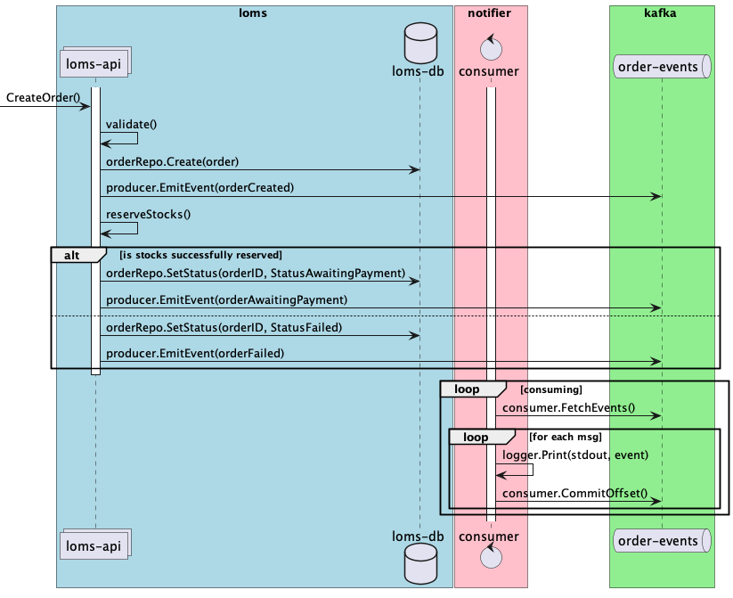

# Домашние задания по модулю "Очереди и асинхронное взаимодействие. Kafka"

## Основное задание

- Необходимо добавить Apache Kafka и ее компоненты в docker окружение, включая:
    - контейнер с брокером
    - контейнер с ui админкой на базе provectuslabs/kafka-ui
    - контейнер для инициализации окружения
- При старте контейнеризированного окружения должна создаваться очередь для событий, связанных с заказами:
    - название очереди должно быть `loms.order-events`
    - фактор репликации должен быть равен 1
    - у очереди должно быть 2 партиции
- Доработать сервис loms таким образом, чтобы он отправлял события, связанные со сменой статуса заказа, в очередь:
    - реализовать код, отвечающий за конфигурацию и установку подключения с Kafka
    - реализовать продюсер (допускается использование как синхронного, так и асинхронного продюсера)
    - запись в БД должна гарантироваться. Если запись в БД осуществлена, то пользователь получает успешный код ответа.
      При этом в случае падения пода или иных проблем (недоступность брокера) запись в очередь может и не состояться,
      это допустимое поведение
    - не допускается отправлять события в очередь, если не удалось зафиксировать состояние заказа в БД
- Разработать новый сервис notifier в соответствии с описанием ниже:
    - добавить новый сервис в docker окружение
    - реализовать код, отвечающий за конфигурацию и за установку подключения с Kafka
    - реализовать консьюмер, который будет логировать поступающие события о заказах
    - использовать consumer группу с хранением смещений в Kafka
    - консьюмеру необходимо фиксировать смещение только после успешной обработки сообщения. Допускается
      фиксировать смещение после обработки каждого сообщения, либо в фоновом процессе (autocommit)
    - при рестарте приложения разбор очереди должен возобновляться с первого необработанного сообщения
    - необходимо обрабатывать ошибки при обработке сообщений из очереди и логировать их в стандартный поток
- Уровень гарантий доставки сообщений между loms и notifier может быть любым
- Должно быть обеспечено корректное завершение (gracefully shutdown) продюсера и консьюмера

## Доработки на стороне loms

При проведении операций над заказом необходимо фиксировать соответствующие события в очереди Kafka.

Необходимо отправлять события при смене статуса заказа:
- Создание заказа статус `new` (осуществляется внутри обработчика OrderCreate)
- Завершение заказа с ошибкой, статус `failed` терминальный (не удалось зарезервировать стоки во время OrderCreate и
  другие ошибки)
- Ожидание оплаты статус `awaiting payment` (осуществляется внутри обработчика OrderCreate)
- Оплата заказа статус `payed` терминальный (осуществляется вызовом OrderPay)
- Отмена заказа, статус `cancelled` терминальный (осуществляется внутри обработчика OrderCancel)

Событие (сообщение в Kafka) должно содержать следующие поля:
- Идентификатор заказа
- Событие, которое произошло с данным заказом
- Временную метку с датой и временем проведения операции
- Дополнительную техническую/бизнес информацию

Должно быть обеспечено:
- Приближенное к равномерному, распределение сообщений по партициям
- Должен гарантироваться хронологический порядок событий в рамках одного заказа, т.е. мы не должны получить события об
  отмене заказа раньше, чем событие о его создании. При этом в рамках основной части задания сообщения могут теряться

## Создание сервиса notifier

Необходимо:
- Разработать новый сервис, настроить для него docker окружение
- При запуске сервис подключается к Kafka и запускает consumer, в рамках consumer-group
- Настройки подключения и другие параметры должны браться из конфигурации, аргументов при запуске или переменных
  окружения
- Консьюмер должен обрабатывать сообщения, поступающие из очереди (которые отправляет loms продюсер). Notifier должен
  логировать каждое получаемое событие в стандартный поток вывода (stdout) любым удобным способом
- Сервис notifier должен запускаться в 3-х экземплярах, при этом т.к. партиции всего две, сообщения должны получать
  только два из них
- Логирование должно осуществляться таким образом, чтобы все сообщения из Kafka топика можно было увидеть в логах
  docker контейнера с помощью команды `docker notifier-1 logs`

## Схема взаимодействия для основного задания

На диаграмме показано создание заказа, но аналогичным образом должны обрабатываться и другие события

## Дополнительное задание

- Необходимо обеспечить гарантию доставки не ниже "at least once"
    - на стороне loms (продюсера) необходимо реализовать tx outbox, создание/изменение заказа и запись в outbox должны
      происходить в одной транзакции с записью в специальную таблицу
    - необходимо реализовать фоновый процесс который будет отправлять сообщения из outbox в Kafka, допускается
      использовать горутину с time.Ticker и опрашивать таблицу outbox с некоторым интервалом, задаваемым через
      конфигурацию. При наличии неотправленных событий, обрабатывать их
    - допускается при разборе outbox-а держать транзакцию открытой на момент отправки сообщения в очередь во избежание
      конкурентного доступа к outbox. Это ограничение допустимо в рамках учебного проекта, но на практике лучше избегать
      удержания открытых транзакций
    - допускается использовать синхронный продюсер

## Схема взаимодействия для дополнительного задания

### Дедлайны сдачи и проверки задания: 
- 20 июля 23:59 (сдача) / 23 июля, 23:59 (проверка)
